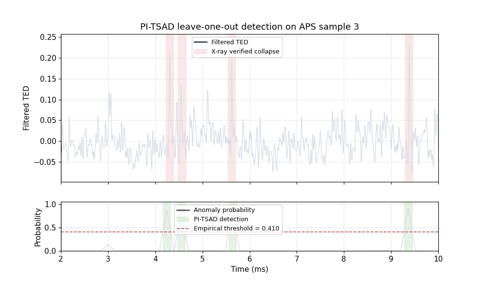

# PI-TSAD

PI-TSAD is a small Python package for anomaly detection in TED signals from
laser powder bed fusion experiments. The repo includes a reproducible 4-fold
cross-validation example on the compact APS datasets `1`, `2`, `3`, and `4`,
plus a separate path for long-running full-part analysis.



The animation above trains on APS samples `1`, `2`, and `4`, then tests on APS
sample `3`, sweeping through the TED signal while the anomaly probability is
computed over time.

## Install

```bash
python -m venv .venv
source .venv/bin/activate
pip install -e ".[dev]"
```

## Run the APS 4-fold example

```bash
pi-tsad cross-validate-aps
```

To save metrics and plots:

```bash
pi-tsad cross-validate-aps \
  --save-csv outputs/aps_cv.csv \
  --plot-dir outputs/aps_plots \
  --summary-plot outputs/aps_probabilities.png
```

PI-TSAD uses an empirical robust-z quantile threshold. The `alpha` setting
controls the score-distribution tail used for detection.

You can also run the importable example:

```bash
python examples/run_aps_cross_validation.py
```

## Train on the APS examples

```bash
pi-tsad train-aps --output models/pi_tsad_aps.joblib
```

## Benchmark

Run the bundled APS benchmark:

```bash
PYTHONPATH=src python benchmarks/benchmark_aps.py --repeats 3
```

This writes `outputs/benchmark_aps.json` with cross-validation runtime,
train-on-all-APS runtime, and mean validation metrics. It benchmarks the
small labeled APS single-track data only. Full-part builds are intentionally
kept as user-provided inference workloads because they can be much slower.

## Apply the model to a full part file

Full part files are expected to be provided locally by the user because they can
be large and slow to process. Start with one layer or a row limit before running
the whole file:

```bash
pi-tsad detect-part models/pi_tsad_aps.joblib path/to/full_part.csv \
  --layer 150 \
  --max-rows 10000 \
  --output outputs/layer_150_predictions.csv
```

For multiple full-scale CSVs, run the slow model pass once and save reusable
probabilities:

```bash
pi-tsad detect-batch models/pi_tsad_aps.joblib "part-scale/*.csv" \
  --output-dir outputs/part-scale \
  --hist-dir outputs/part-scale-histograms \
  --summary-plot outputs/part-scale_probability_distributions.png
```

This writes one `*_probabilities.csv` per input file. Those probability files
let you change the cutoff later without rerunning the full part:

```bash
pi-tsad threshold-probabilities "outputs/part-scale/*_probabilities.csv" \
  --cutoff 0.35 \
  --output-dir outputs/cutoff-035 \
  --hist-dir outputs/cutoff-035-histograms \
  --summary-plot outputs/cutoff-035_probability_distributions.png
```

If `--cutoff` is omitted, PI-TSAD recomputes the empirical probability cutoff
from each saved probability distribution using `--alpha`. The histogram outputs
are KDE-style probability-density plots with nominal/anomalous regions split at
the actual selected cutoff.

## Python API

```python
from pi_tsad.evaluation import cross_validate_aps
from pi_tsad.model import PITSADConfig

config = PITSADConfig(window_radius=15, radius_multiplier=2, alpha=0.06)
summary, artifacts = cross_validate_aps(config=config)
print(summary)
```

## Citation

If you use PI-TSAD in your work, please cite:

Carter Taylor, Conor Porter, Garrett Mathesen, Kyle Mumm, Fred Carter, Jian Cao,
"PI-TSAD: A physically informed time-series anomaly detection framework for
real-time monitoring of keyhole collapse in laser powder bed fusion," Journal of
Manufacturing Processes, Volume 168, 2026, Pages 178-191, ISSN 1526-6125.

DOI: [10.1016/j.jmapro.2026.04.026](https://doi.org/10.1016/j.jmapro.2026.04.026)

ScienceDirect:
[S152661252600383X](https://www.sciencedirect.com/science/article/pii/S152661252600383X)

Abstract: Reliable in-situ detection of keyhole collapse in Laser Powder Bed
Fusion (LPBF) remains challenging due to the transient nature of the melt pool
and the inherent stochasticity of the process. This study presents a physically
informed, machine learning-based framework that identifies collapse events
directly from Thermal Energy Density (TED) obtained from coaxial photodiodes
with a sampling rate of 200 kHz. Power Spectral Density (PSD) analysis of the
TED signal revealed that low-frequency regions are dominated by pink noise and
high-frequency regions by white noise, with bulk melt pool motion and collapse
dynamics confined to the intermediate band. Accordingly, a 0.25-30 kHz
band-pass filter was applied to the TED signal to isolate the melt pool
dynamics. Statistical and frequency-domain features from the filtered TED are
used to train a Random Forest anomaly detection model using ground truth data
from the Advanced Photon Source, where high-speed operando X-ray imaging
verified collapse events. Applied to full build TED data from a commercial DMG
MORI LASERTEC 12 SLM (LPBF) machine, the framework generalizes within the same
material system and sensing modality without retraining, preserving a strong
correlation between predicted anomalies and part-level CT-measured porosity. By
integrating physics-based filtering, feature-driven learning, and adaptive
thresholding, this method provides a scalable and interpretable foundation for
real-time LPBF defect detection and monitoring.

Keywords: Laser powder bed fusion; Keyhole porosity; Time series anomaly
detection; Random Forest Model

## Repository Layout

```text
src/pi_tsad/          core package
examples/            runnable examples
tests/               regression tests
data/aps/            compact APS CSVs for the public example
docs/                notes for maintainers and users
```

The original notebook/source folder is ignored and kept out of the public repo.

## Expected Compact CSV Format

The APS example loader expects at least these columns:

- `time`: sample time in seconds
- `TED`: TED signal value

Full part analysis expects columns equivalent to `x`, `y`, `TEP`, `TED`, and
`layer` after the first metadata row, matching the existing full-part workflow.
