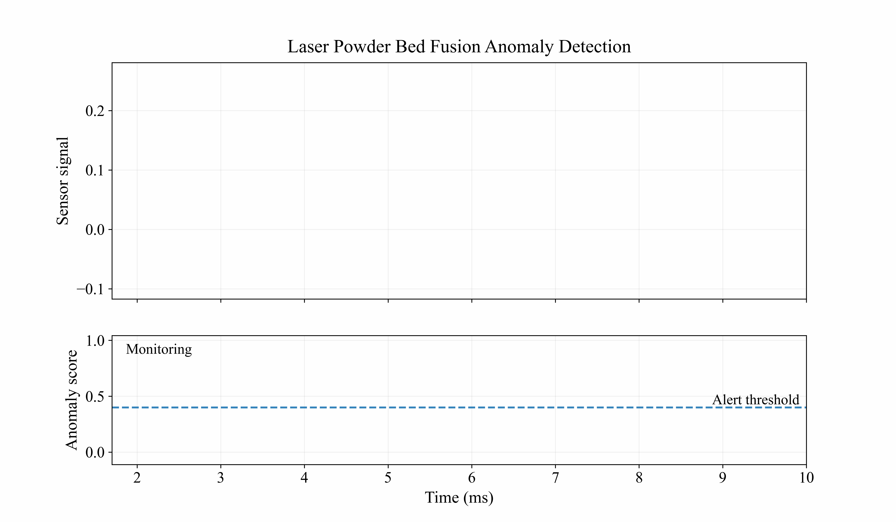

# PI-TSAD

PI-TSAD is a small Python package for anomaly detection in TED signals from
laser powder bed fusion experiments. The repo includes a reproducible 4-fold
cross-validation example on the compact APS datasets `050`, `053`, `074`, and
`077`, plus a separate path for long-running full-part analysis.



## Install

```bash
python -m venv .venv
source .venv/bin/activate
pip install -e ".[dev]"
```

## Run the APS 4-fold example

```bash
pi-tsad cross-validate-aps
```

To save metrics and plots:

```bash
pi-tsad cross-validate-aps \
  --save-csv outputs/aps_cv.csv \
  --plot-dir outputs/aps_plots \
  --summary-plot outputs/aps_probabilities.png
```

PI-TSAD uses an empirical robust-z quantile threshold. The `alpha` setting
controls the score-distribution tail used for detection.

You can also run the importable example:

```bash
python examples/run_aps_cross_validation.py
```

## Train on the APS examples

```bash
pi-tsad train-aps --output models/pi_tsad_aps.joblib
```

## Benchmark

Run the bundled APS benchmark:

```bash
PYTHONPATH=src python benchmarks/benchmark_aps.py --repeats 3
```

This writes `outputs/benchmark_aps.json` with cross-validation runtime,
train-on-all-APS runtime, and mean validation metrics. It benchmarks the
small labeled APS single-track data only. Full-part builds are intentionally
kept as user-provided inference workloads because they can be much slower.

## Apply the model to a full part file

Full part files are expected to be provided locally by the user because they can
be large and slow to process. Start with one layer or a row limit before running
the whole file:

```bash
pi-tsad detect-part models/pi_tsad_aps.joblib path/to/full_part.csv \
  --layer 150 \
  --max-rows 10000 \
  --output outputs/layer_150_predictions.csv
```

## Python API

```python
from pi_tsad.evaluation import cross_validate_aps
from pi_tsad.model import PITSADConfig

config = PITSADConfig(window_radius=15, radius_multiplier=2, alpha=0.06)
summary, artifacts = cross_validate_aps(config=config)
print(summary)
```

## Repository Layout

```text
src/pi_tsad/          core package
examples/            runnable examples
tests/               regression tests
data/aps/            compact APS CSVs for the public example
docs/                notes for maintainers and users
```

The original notebook/source folder is ignored and kept out of the public repo.

## Expected Compact CSV Format

The APS example loader expects at least these columns:

- `time`: sample time in seconds
- `TED`: TED signal value

Full part analysis expects columns equivalent to `x`, `y`, `TEP`, `TED`, and
`layer` after the first metadata row, matching the existing full-part workflow.
